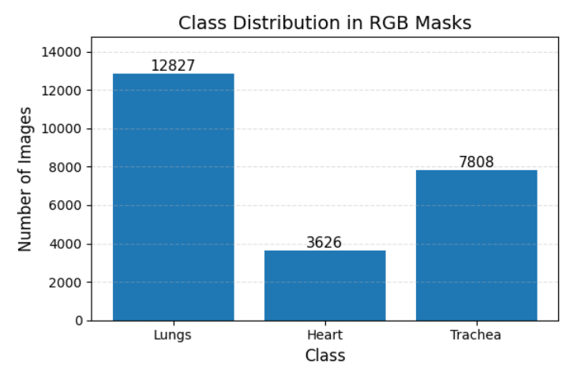
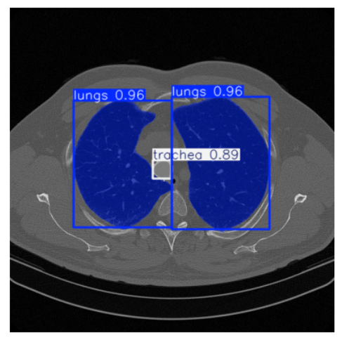
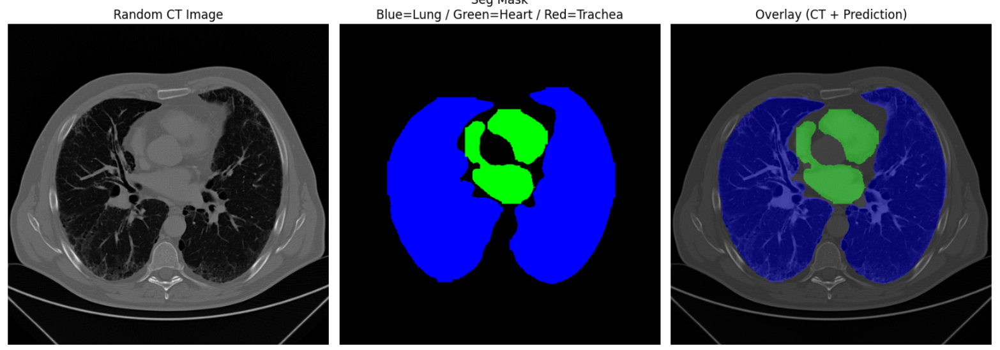
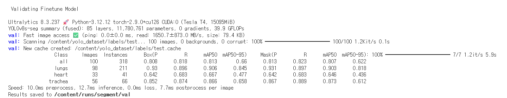
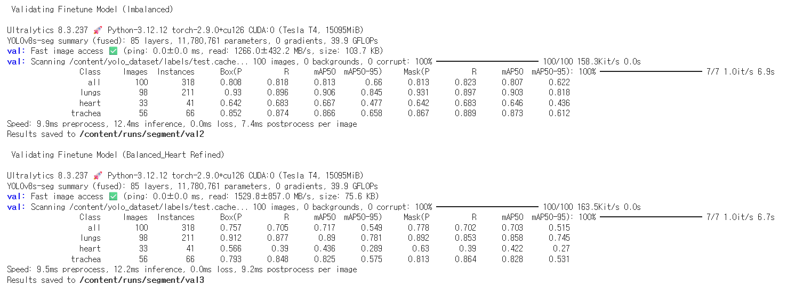
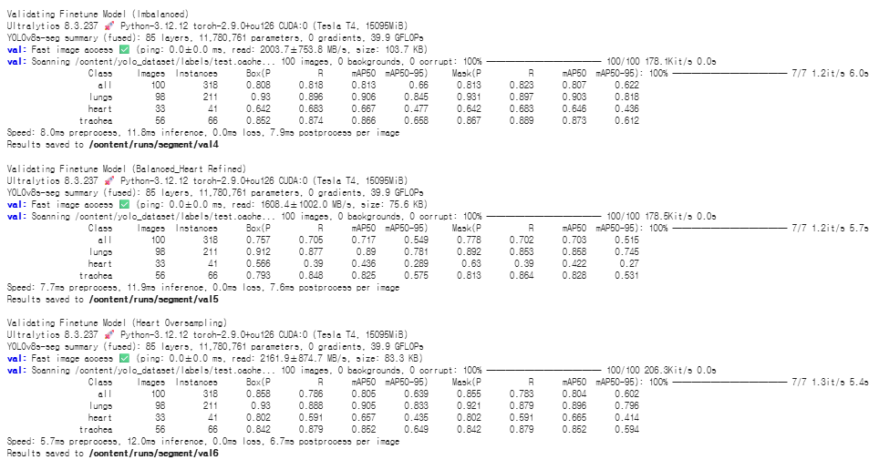
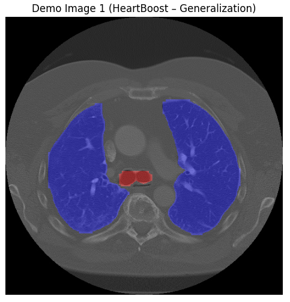
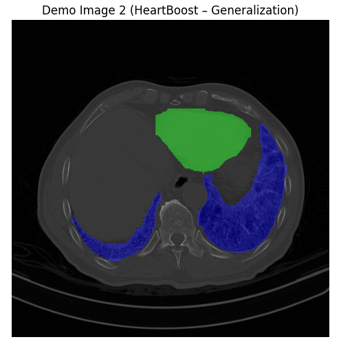
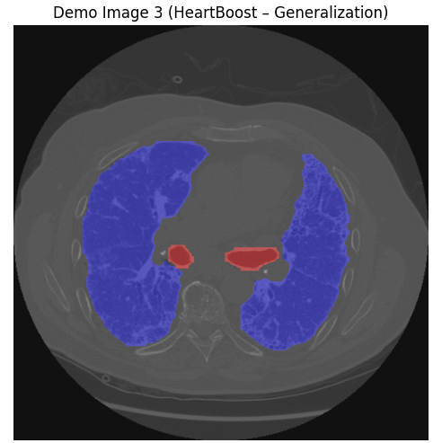
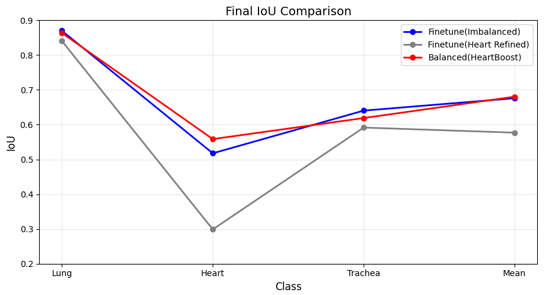

# YOLOv8-CT-Organ-Segmentation

## Overview

This project focuses on organ segmentation in chest CT images using the YOLOv8 segmentation model. A data-centric approach was adopted to improve segmentation performance by analyzing class imbalance and refining the training dataset. The project targets the segmentation of three organs: lungs, heart, and trachea.

---

## Features

- Chest CT organ segmentation using YOLOv8-Seg
- Segmentation of lungs, heart, and trachea
- Dataset analysis for class imbalance
- Data-centric training strategy
- Model performance comparison
- Visualization of segmentation results
- IoU-based performance evaluation

---

## Dataset

- Medical chest CT images
- Three segmentation classes:
  - Lungs
  - Heart
  - Trachea

### Class Distribution



---

## Tech Stack

- Python
- Google Colab
- YOLOv8 (Ultralytics)
- PyTorch
- OpenCV
- NumPy
- Matplotlib

---

## Model Pipeline

1. Analyze dataset distribution
2. Train YOLOv8 segmentation model
3. Evaluate segmentation performance
4. Compare multiple training strategies
5. Visualize prediction results

---

## Segmentation Results

### YOLOv8 Prediction



### CT Image, Segmentation Mask, and Overlay



---

## Model Evaluation

### Fine-tuning Performance



### Model Comparison (Imbalanced vs Heart Refined)



### Model Comparison (Imbalanced vs Heart Refined vs Balanced)



---

## Generalization Results

### Demo Image 1



### Demo Image 2



### Demo Image 3



---

## Final Performance Comparison

The final IoU comparison demonstrates the segmentation performance of three different training strategies. The balanced training approach (HeartBoost) improves heart segmentation while maintaining competitive performance for lung and trachea segmentation.



---

## Installation

```bash
pip install ultralytics
pip install opencv-python
pip install matplotlib
pip install numpy
```

or

```bash
pip install -r requirements.txt
```

---

## Project Highlights

- Implemented a YOLOv8-based medical image segmentation model.
- Performed data-centric analysis to address class imbalance.
- Compared multiple training strategies for segmentation performance.
- Evaluated model performance using IoU metrics.
- Visualized prediction results on chest CT images.
- Improved heart segmentation through dataset refinement.
